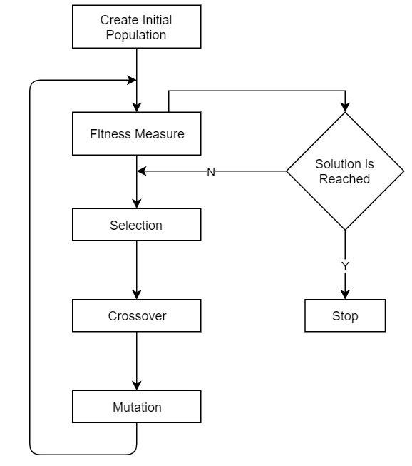

# Genetic-Knapsack

This project implements a genetic algorithm to solve the knapsack problem, a classic optimization problem in computer science and operations research.

## Overview

The knapsack problem is a combinatorial optimization problem where the goal is to maximize the total value of items selected into a knapsack, given a set of items each with a weight and a value, and a knapsack capacity.

This project provides a C++ implementation of a genetic algorithm to solve the knapsack problem. The algorithm evolves a population of potential solutions (chromosomes) over multiple generations, using techniques such as selection, crossover, and mutation to explore the solution space and find optimal or near-optimal solutions.



## Requirements

- C++ compiler with support for C++11 or later
- CMake (version 3.0 or higher)
- Boost library (for the Gnuplot header file)

## Usage

1. Install Boost library:
    Linux:
   ```bash
   sudo apt-get install libboost-all-dev
   ```
    Windows:
    ```bash
    ./vcpkg install boost
    ```
2. Clone or download the repository to your local machine.
3. Navigate to the project directory:
   ```bash
   cd Genetic-Knapsack
4. Create a build directory:
   ```bash
   mkdir build
   cd build
5. Generate build files using CMake:
   ```bash
    cmake ..
    ```
6. Build the project:
    ```bash
    make
    ```
7. Run the program:
    ```bash
    ./genetic_knapsack
    ```
8. The program will prompt you to enter the knapsack capacity, population size, and number of generations. After the algorithm finishes, it will display the best solution found and plot a graph of the fitness values over generations.